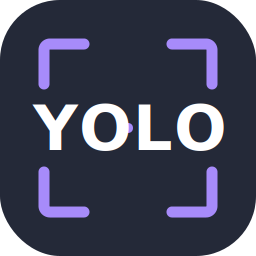
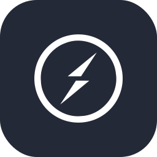
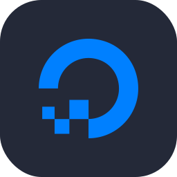
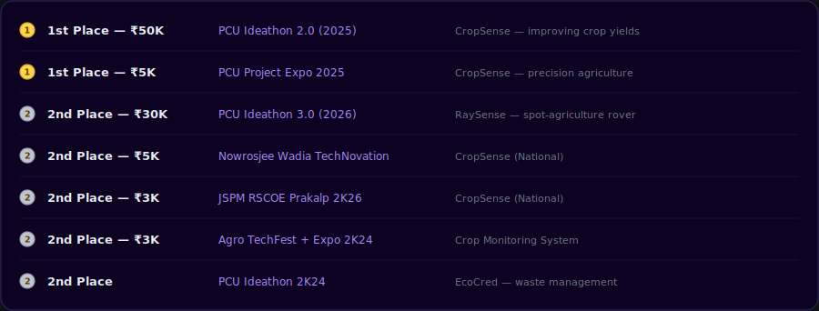

<!-- ════════════════════  AMAN SHAIKH · github.com/m4xy07  ════════════════════ -->

<!-- HERO BANNER (custom animated SVG) -->

 
  

<!-- ANIMATED TYPING SUBTITLE -->

  

<!-- SOCIAL BADGES -->

  
  
  
  
  

<!-- analytics (invisible) -->

 

<!-- ════════════════════  WHOAMI  ════════════════════ -->
<h3 align="center">⟡ &nbsp; <samp>whoami</samp> &nbsp; ⟡</h3>

Final-year $`\textcolor{#a78bfa}{\textsf{CS Engineering}}`$ student at PCET's Pimpri Chinchwad University, building software 
where $`\textcolor{#a78bfa}{\textsf{AI}}`$, $`\textcolor{#a78bfa}{\textsf{IoT}}`$, and scalable full-stack systems meet the real world. 
I like shipping things that move a metric - yields up $`\textcolor{#87ceeb}{\textsf{30\%}}`$, invoice errors down $`\textcolor{#87ceeb}{\textsf{60\%}}`$, retention up $`\textcolor{#87ceeb}{\textsf{125\%}}`$. 
When I'm not coding, I'm probably winning a hackathon (that's happened $`\textcolor{#a78bfa}{\textsf{8 times}}`$ 🏆).

  <code>🌍 Pune, India</code> &nbsp; <code>🎓 B.Tech CSE '27</code> &nbsp; <code>🤖 AI · IoT · Full-Stack</code> &nbsp; <code>⚡ Junior Dev @ Envotech</code>

<!-- ════════════════════  TECH ARSENAL  ════════════════════ -->
<h3 align="center">⟡ &nbsp; <samp>Tech Arsenal</samp> &nbsp; ⟡</h3>

<b>LANGUAGES</b>

  

<b>FRAMEWORKS · WEB · CLOUD</b>

  

<b>AI / ML · IoT · HARDWARE</b>

  
  
  
  

<!-- ════════════════════  GITHUB STATS  ════════════════════ -->
<h3 align="center">⟡ &nbsp; <samp>GitHub Constellation</samp> &nbsp; ⟡</h3>

<table align="center">
  <tr>
    <td align="center">
      
    </td>
    <td align="center">
      
    </td>
    <td align="center">
      
    </td>
  </tr>
</table>

  

<!-- SNAKE (generated daily by GitHub Action - see .github/workflows/snake.yml) -->
<h3 align="center">⟡ &nbsp; <samp>Watch the snake eat my commits</samp> &nbsp; ⟡</h3>

  <picture>
    <source media="(prefers-color-scheme: dark)" srcset="https://raw.githubusercontent.com/m4xy07/m4xy07/output/github-snake-dark.svg"/>
    <source media="(prefers-color-scheme: light)" srcset="https://raw.githubusercontent.com/m4xy07/m4xy07/output/github-snake-dark.svg"/>
    
  </picture>

<!-- ════════════════════  FEATURED PROJECTS  ════════════════════ -->
<h3 align="center">⟡ &nbsp; <samp>Featured Missions</samp> &nbsp; ⟡</h3>

<table width="100%">
<tr>
<td width="50%" valign="top">

#### 🌾 &nbsp;CropSense
**AI + IoT Smart Agricultural Monitoring** 
Raspberry Pi + IoT sensors stream live farm data; ML pipelines run computer-vision crop-disease detection. **+30% yields**, **85–92% detection accuracy**, **+125% user retention** on the KPI dashboard.

   

🥇 1st @ PCU Ideathon 2.0 · ₹50K &nbsp;|&nbsp; +5 more wins

</td>
<td width="50%" valign="top">

#### 🤖 &nbsp;Aura
**Facial-Expression Humanoid Robot** 
AI-driven Raspberry Pi bot with speech-to-text and facial recognition, expressing **5+ unique emotions** in real time. Boosted user interaction **+25%** in beta testing.

  

🗣️ Speech + Vision · 🎭 Emotive HRI

</td>
</tr>
<tr>
<td width="50%" valign="top">

#### 📚 &nbsp;Comic PDF Downloader
**Async Comic-to-PDF Web App** 
Flask app for automated comic→PDF conversion with **Socket.IO** + **APScheduler** for asynchronous processing and real-time progress updates.

  

</td>
<td width="50%" valign="top">

#### 🔋 &nbsp;EcoCred
**Recycling & Sustainability Platform** 
Credit-based recycling rewards system with RFID/fingerprint login, smart waste detection, and a green-impact dashboard to nudge sustainable habits.

 

🥈 2nd @ PCU Ideathon 2K24

</td>
</tr>
</table>

↪ explore everything on <a href="https://amanshaikh.dev">amanshaikh.dev</a>

<!-- ════════════════════  TROPHY CASE  ════════════════════ -->
<h3 align="center">⟡ &nbsp; <samp>Trophy Case</samp> &nbsp; ⟡</h3>

  

<!-- RANK TROPHIES - via trophy.benkou.dev (maintainer-listed mirror; reliable, no per-viewer rate limit) -->

  

<!-- ════════════════════  SUMMARY CARDS  ════════════════════

  

 -->

<!-- ════════════════════  FOOTER  ════════════════════ -->

  

  
  
  

<samp>「 thanks for orbiting by ✦ 」</samp>

